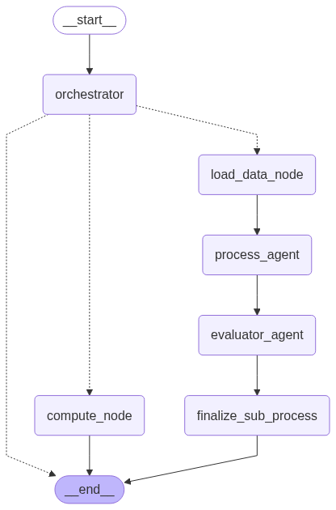
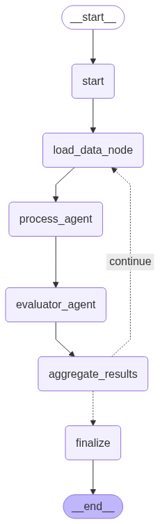

# LangGraph를 활용한 건설 내역 분석 멀티 에이전트 시스템

## 1. 프로젝트 개요
복잡하고 방대한 엑셀 형식의 건설 공사 내역서 데이터를 사용자가 자연어 질문을 통해 쉽게 분석하고 원하는 정보를 얻을 수 있도록 돕는 멀티 에이전트 시스템. LangGraph를 기반으로 각기 다른 에이전트들을 활용하여 사용자의 의도를 파악하고, 데이터를 처리하며, 최종 결과를 생성하는 워크플로우를 구현하였음

## 2. 핵심 기능
* 세부 공종 추출(`sub_process_extraction`): 특정 공사 파일 내에서 사용자가 질의한 공종(예: 교량 공사)의 모든 하위 세부 내역을 추출하여 보여준다.
* 일반 비용 분석(`general_cost_analysis`): 전체 데이터 파일들을 모두 분석하여 특정 공종(예: 교량)의 평균 비용을 계산하고 통계 정보를 제공

## 3. 시스템 아키텍처
LangGraph의 `StateGraph`를 기반으로 설계되었으며, 각기 다른 역할을 수행하는 노드(에이전트)들이 상태(State)를 공유하며 유기적으로 연결된다. 전체 워크플로우는 `main.py`에 정의되어 있으며, 메인 그래프와 `compute_node` 내부에서 동작하는 서브그래프로 구성된다.

### 3.1. 메인 그래프 흐름


1. Orchestrator: 사용자의 최초 질문을 받아 분석하는 시스템의 진입점이다. 질문의 의도를 파악하여 '세부 공종 추출' 또는 '일반 비용 분석' 중 어떤 작업인지 결정하고, 필요한 파라미터(파일명, 공종명 등)를 추출하여 다음 노드로 전달한다.
2. Conditional Edge: Orchestrator가 결정한 작업 종류(`task`)에 따라 워크플로우를 두 가지 경로 중 하나로 분기한다.
    * `sub_process_extraction` -> `load_data_node`로 이동
    * `general_cost_analysis` -> `compute_node`로 이동

### 3.2. 경로 1: 세부 공종 추출 (Sub Process Extraction)
* `load_data_node`: Orchestrator가 지정한 파일을 로드하여 데이터프레임으로 변환
* `process_agent`: 로드된 데이터 전체에서 사용자가 요청한 공종과 관련성이 높은 1차 후보 목록을 LLM을 통해 탐색하고 추출
* `evaluator_agent`: `process_agent`가 찾은 후보 목록이 적절하게 추출되었는지 평가 및 검증하여 핵심적인 상위 공종만 필터링
* `finalize_sub_process`: `evaluator_agent`가 확정한 상위 공종 및 그에 속한 모든 하위 공종 내역을 데이터에서 찾아 최종 결과 문자열로 반환

### 3.3. 경로 2: 일반 비용 분석 (General Cost Analysis)

이 경로는 여러 파일에 걸쳐 특정 공종의 평균 비용을 계산하는 작업을 수행. 자체적인 서브그래프를 가진다.



* `compute_node`: `ComputeAgent` 내부에 정의된 서브그래프를 실행시킨다. 이 서브그래프는 `data` 폴더에 있는 모든 파일을 순회하며 다음 작업을 반복 수행한다.
    1.  파일 하나를 로드 (`_load_data_node`)
    2.  해당 파일에서 관련 공종 후보 찾기 (`_process_agent`)
    3.  찾은 후보를 검증 (`_evaluator_agent`)
    4.  검증된 공종의 비용을 집계 (`_aggregate_results`)
* 모든 파일 순회가 끝나면, 집계된 비용 데이터를 바탕으로 최종 평균 비용을 계산하여 결과를 반환한다. (`_finalize_computation`)

## 4. 파일 구조
```
multi-agent_langGraph/
│
├── agents/
│   ├── init.py
│   ├── orchestrator.py         # 1. 사용자 의도 분석 및 작업 계획 에이전트
│   ├── process_agent.py        # 2. 데이터 기반 1차 후보 공종 추출 에이전트
│   ├── evaluator_agent.py      # 3. 후보 공종 검증 및 필터링 에이전트
│   └── compute_agent.py        # 4. 비용 분석 서브그래프를 관리하는 에이전트
│
├── data/
│   └── (공사 내역서 .txt 파일들 위치)
│
└── main.py
```
* `main.py`: 프로젝트의 진입점. 전체 에이전트를 초기화하고 LangGraph 워크플로우를 정의 및 컴파일.
* `data/`: 분석의 대상이 되는 원본 `.txt` 형식의 공사 내역서 파일들을 저장하는 디렉토리. 기존 엑셀 파일을 budget-sheet 코드로 전처리해서 저장해놓아야함.<br>
    * 형식: 각 행은 "record: 공종명; 규격; 비용" 구조를 가지며, 콜론(:)과 세미콜론(;)으로 구분된다.
    ```
    예시:
    토목.01.01.01.01: ...-1. 무근콘크리트; T=30cm 미만(기계 100%); 10562112
    ```

## 5. 실행 방법

### 5.1. 사전 준비

1. Python 3.11.13
    ```
    pip install -r requirements.txt
    ```
2. data 폴더에 파일 구조를 맞춰서 전처리한 데이터 저장

### 5.2. 실행

콘솔에 나타나는 "어떤 공종에 대해 알아보고 싶으신가요?"라는 질문에 자연어로 원하는 내용을 입력한다.

    * 세부 공종 추출 예시: `북일-남일1 Q1 공사에서 교량공사`
    * 일반 비용 분석 예시: `일반적인 교량 공사 비용`